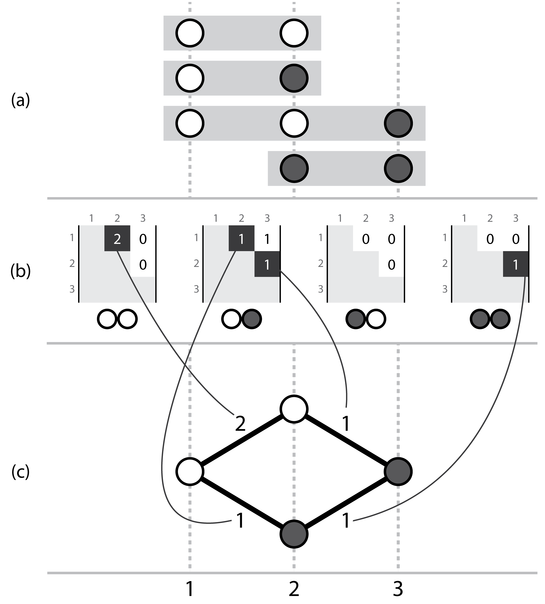

About
=====

What is it for?
---------------

**Hansel** was originally created as a means to store evidence of genetic variation
observed across short sequences called *reads*. These reads can be aligned against
one another to create longer sequences (contigs). Of interest, are the locations
at which reads that overlap exhibit variation from other reads.

We want to recover the chains of symbols (DNA nucleotides) that are most likely
to appear from the start to the end of the contig, over the genomic positions
that have been demonstrated to vary.

We recognised that **Hansel** had additional potential outside of our use-case,
not only to serve as a data structure for creation of future algorithms that want
to interact with variation of DNA, but also in other fields entirely, such as
computational linguistics.

**Hansel** can be used where you have a defined set of possible states or symbols that
occur in time or space. For example:

* DNA, RNA or amino acids, over a sequence
* Words in order, from a book, or page
* States that occur in a simple ordered machine or system
* User or actor actions that occur over time

How is data stored?
-------------------
**Hansel** is a four dimensional matrix. An element `H[a, b, i, j]` record the number of observations of a co-occurring pair of symbols `a` and `b` at positions `i` and `j` respectively.
At first this structure may appear limited, but the data in `H` can easily be exploited to build other structures.

How does it work?
-----------------

   Three corresponding representations, (a) a set of short ordered sequences, with symbols, (b) the actual Hansel structure where each possible pair of symbols (00, 01, 10, 11) has a matrix storing counts of occurrences of that ordered symbol pair between two positions across all of the aligned sequences in a, (c) a simple graph that can be constructed by considering the evidence provided by adjacent variant symbols. Note this representation ignores evidence from non-adjacent pairs, which is overcome by the dynamic edge weighting of the Hansel data structure's interface.

